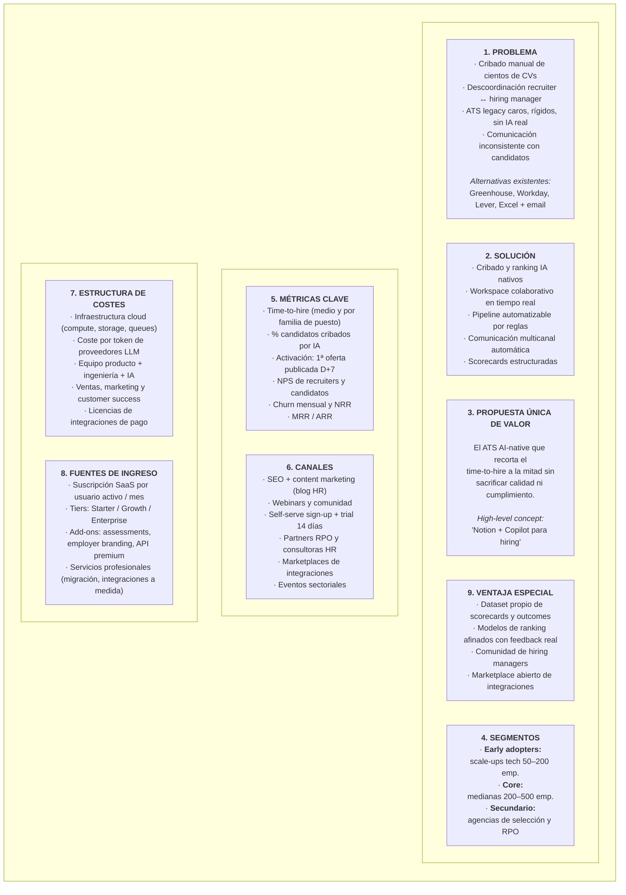
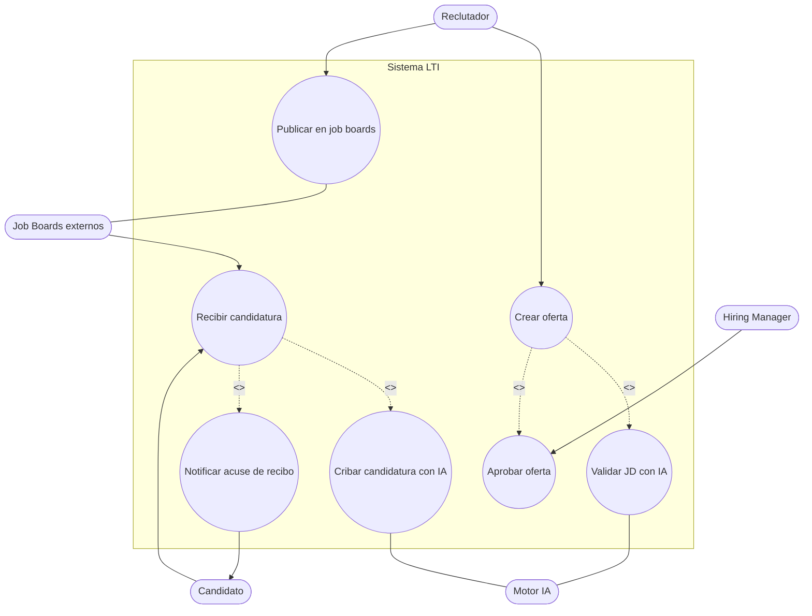
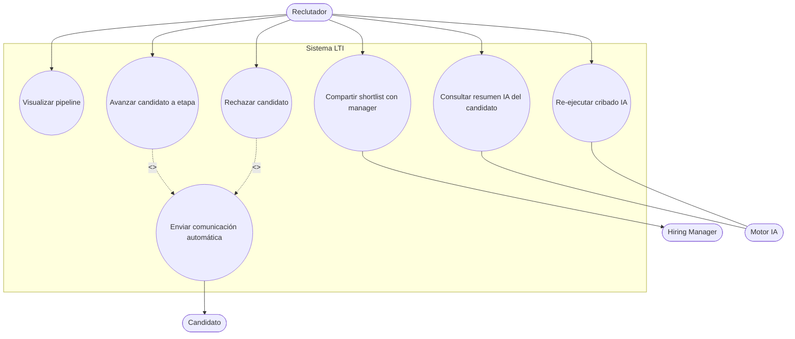
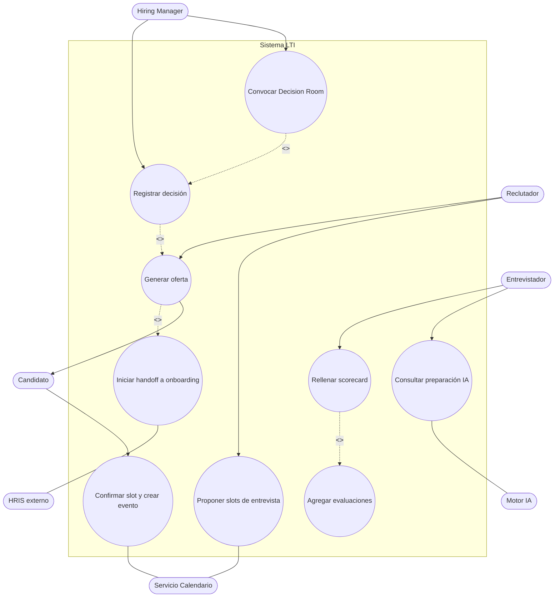
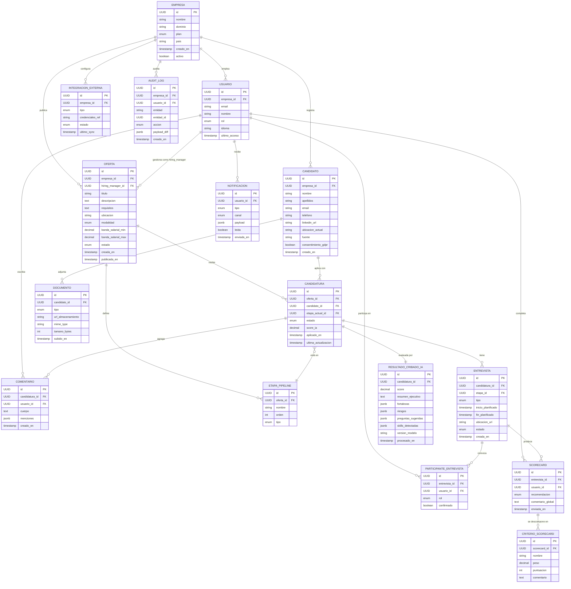
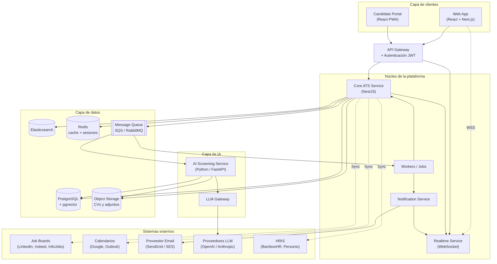
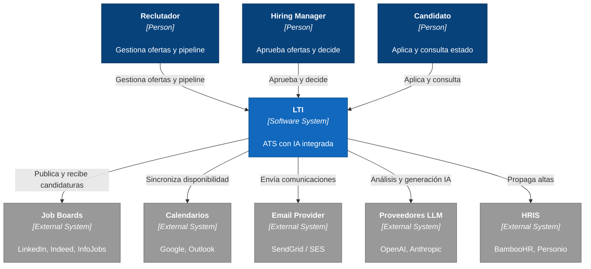
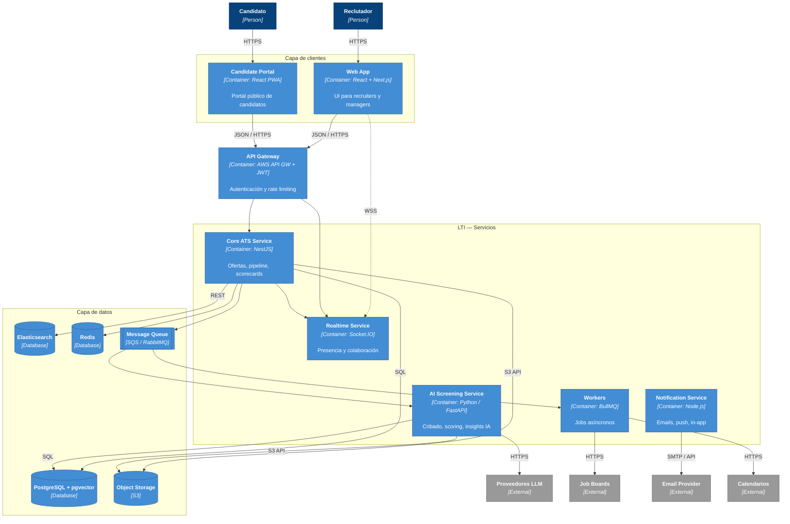
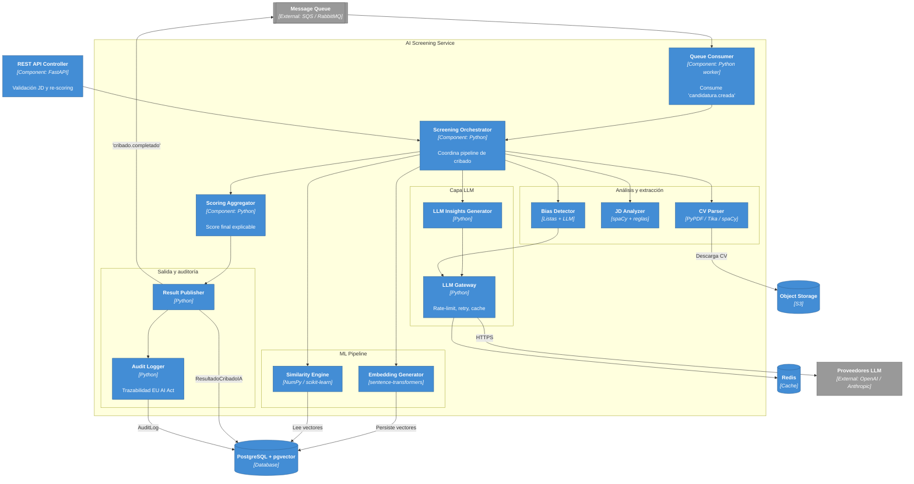

# LTI · Diseño del Sistema ATS

> **Autor:** Antonio Jiménez Martínez (AJM)
> **Máster:** AI4Devs · Módulo 4 — Análisis y diseño de sistemas con IA
> **Asistente utilizado:** Claude (Opus 4.7)
> **Fecha:** Mayo 2026

---

## Índice

1. [Descripción de LTI, valor añadido y ventajas competitivas](#1-descripción-de-lti-valor-añadido-y-ventajas-competitivas)
2. [Funciones principales](#2-funciones-principales)
3. [Lean Canvas](#3-lean-canvas)
4. [Casos de uso principales](#4-casos-de-uso-principales)
5. [Modelo de datos](#5-modelo-de-datos)
6. [Diseño del sistema a alto nivel](#6-diseño-del-sistema-a-alto-nivel)
7. [Diagrama C4 — AI Screening Service](#7-diagrama-c4--ai-screening-service)

---

## 1. Descripción de LTI, valor añadido y ventajas competitivas

### 1.1. ¿Qué es LTI?

**LTI** es una plataforma SaaS B2B multi-tenant que cubre el ciclo completo de selección de personal (Applicant Tracking System) con **inteligencia artificial integrada desde el diseño**. El sistema acompaña a un puesto vacante desde la redacción de la oferta hasta la contratación final, automatizando las tareas repetitivas y centralizando la colaboración entre los equipos de Recursos Humanos y los responsables de contratación.

A diferencia de los ATS tradicionales — que partieron como bases de datos de CVs y han ido añadiendo capacidades de IA como módulos externos —, LTI nace con la IA como pieza estructural: el cribado, el ranking, la detección de sesgos y la asistencia en entrevistas no son add-ons, sino servicios de primera clase del sistema.

### 1.2. Público objetivo

| Segmento | Tamaño | Necesidad principal |
|---|---|---|
| Empresas medianas en sectores tech, servicios profesionales y consultoría | 50–500 empleados | Reducir el tiempo de contratación sin sacrificar calidad |
| Departamentos de Talent Acquisition con 3–15 reclutadores | — | Coordinar mejor a recruiters y managers en procesos paralelos |
| Agencias de selección y RPO | 10–100 reclutadores | Gestionar múltiples clientes y procesos en una sola herramienta |

### 1.3. Valor añadido

- **Reducción del time-to-hire**: el cribado automático y la programación de entrevistas integrada con calendario eliminan días de espera en cada etapa del pipeline.
- **Mejora de la calidad de contratación**: el ranking objetivo basado en similitud semántica entre el CV y la descripción del puesto, junto con scorecards estructuradas, ayuda a tomar decisiones más consistentes.
- **Trazabilidad y cumplimiento normativo**: cada decisión automática queda registrada, explicable y auditable — clave para cumplir con GDPR y con el reglamento europeo sobre IA (EU AI Act).
- **Colaboración fluida**: reclutadores y hiring managers trabajan en un mismo espacio en tiempo real, sin reenviar Excel ni hilos de correo.

### 1.4. Ventajas competitivas

| Eje | LTI | Competencia típica |
|---|---|---|
| **IA nativa** | Cribado, ranking, resúmenes y detección de sesgos integrados de origen | Módulos opcionales o de terceros |
| **Colaboración** | Edición simultánea de scorecards y comentarios en tiempo real (estilo Notion) | Comentarios asíncronos o por correo |
| **Pricing** | Suscripción por usuario activo con tier base accesible | Contratos enterprise rígidos con setup elevado |
| **Time-to-value** | Onboarding en horas, primera oferta publicada el día 1 | Implantaciones de semanas o meses |
| **Apertura** | API pública + marketplace de integraciones (job boards, ATS legacy, HRIS) | Ecosistemas cerrados |
| **Cumplimiento** | GDPR + EU AI Act + DEI/bias auditing por defecto | Compliance reactivo |

---

## 2. Funciones principales

Las funcionalidades de LTI se agrupan en torno a los cuatro ejes que el enunciado del ejercicio identifica como claves del éxito: eficiencia HR, colaboración en tiempo real, automatizaciones y asistencia de IA.

### 2.1. Eficiencia para el departamento de RRHH

- **Gestión centralizada de ofertas**: creación, edición, clonación y archivado de vacantes con plantillas reutilizables.
- **Publicación multi-canal con un clic**: distribución a job boards (LinkedIn, Indeed, InfoJobs) y a la propia página de empleo de la empresa.
- **Pipeline visual configurable**: vista kanban con etapas personalizables por tipo de puesto (técnico, comercial, ejecutivo…).
- **Búsqueda avanzada y talent pool**: localización semántica de candidatos del histórico para reabrir conversaciones cuando aparece una oferta compatible.
- **Reporting operativo**: dashboards de funnel, time-to-hire, source-of-hire y carga de trabajo por recruiter.

### 2.2. Colaboración en tiempo real entre reclutadores y managers

- **Scorecards estructuradas**: plantillas de evaluación con criterios ponderados, cumplimentadas en vivo durante la entrevista.
- **Comentarios in-line** sobre el perfil del candidato, con menciones (@usuario) y notificaciones inmediatas.
- **Decision Room**: espacio dedicado al debrief tras la ronda de entrevistas, con resumen agregado de scorecards y votación.
- **Presencia y co-edición**: los usuarios ven en tiempo real quién está revisando qué candidato, evitando trabajo duplicado.

### 2.3. Automatizaciones

- **Comunicación con candidatos**: emails automáticos de acuse de recibo, cambios de estado y rechazo, con plantillas personalizables y variables dinámicas.
- **Reglas de pipeline**: triggers que mueven candidaturas entre etapas según criterios (p. ej., "si score IA > 80, mover a *Phone Screen*").
- **Programación de entrevistas**: sincronización con Google Calendar y Outlook, propuesta de slots, gestión de zonas horarias y envío automático de invitaciones.
- **Handoff a onboarding**: integración con HRIS (BambooHR, Personio, Workday) para crear el alta del empleado tras la firma del contrato.

### 2.4. Asistencia de IA

- **Cribado automático de CVs**: parsing estructurado (experiencia, formación, skills, idiomas) y scoring de fit respecto a la oferta.
- **Matching semántico** entre CV y JD basado en embeddings, no en keywords.
- **Resumen ejecutivo del candidato**: bullet points con fortalezas, riesgos y preguntas sugeridas para la entrevista.
- **Detección de sesgos en descripciones de puesto**: aviso al recruiter sobre lenguaje no inclusivo o requisitos potencialmente discriminatorios.
- **Análisis de scorecards**: detección de inconsistencias o sesgos en las evaluaciones agregadas.
- **Asistente conversacional para candidatos**: chatbot que responde preguntas frecuentes sobre el proceso, beneficios y estado de la candidatura.

---

## 3. Lean Canvas

El siguiente Lean Canvas resume el modelo de negocio de LTI.

---

## 4. Casos de uso principales

Se describen a continuación los tres casos de uso que componen el flujo nuclear de LTI en la primera versión del producto. Cada caso de uso se acompaña de su diagrama UML en formato Mermaid.

### 4.1. CU-01 — Publicar oferta y captar candidaturas

**Actor principal:** Reclutador
**Actores secundarios:** Hiring Manager, Job Boards externos, Candidato, Motor de IA (validación de JD)

**Precondiciones:**
- El reclutador está autenticado en LTI.
- La empresa tiene activa la integración con al menos un job board.

**Flujo principal:**
1. El reclutador inicia la creación de una nueva oferta y selecciona una plantilla o parte de cero.
2. Cumplimenta los datos: título, descripción, requisitos, ubicación, modalidad, banda salarial y pipeline de etapas.
3. El sistema invoca al **AI Screening Service** para analizar la descripción del puesto y detectar lenguaje sesgado o requisitos potencialmente discriminatorios; muestra al reclutador las sugerencias.
4. El reclutador asigna al hiring manager responsable, que recibe una notificación y aprueba la oferta.
5. El reclutador publica la oferta: el sistema la distribuye a los job boards seleccionados y a la página de empleo corporativa.
6. Los candidatos aplican desde los canales externos; LTI recibe las candidaturas, deduplica perfiles y registra el `source-of-hire`.
7. Cada nueva candidatura dispara un trabajo de cribado IA que genera un score inicial y un resumen del perfil.
8. El reclutador puede revisar el funnel actualizado en tiempo real.

**Flujos alternativos:**
- 3a. Si la oferta contiene lenguaje no inclusivo bloqueante, el sistema lo marca como aviso y exige confirmación.
- 5a. Si falla la publicación en algún job board, el sistema reintenta y notifica al reclutador.

**Postcondiciones:**
- La oferta está publicada en los canales seleccionados.
- Las candidaturas recibidas están en el pipeline con un score inicial asignado.

---

### 4.2. CU-02 — Cribar y rankear candidatos con asistencia de IA

**Actor principal:** Reclutador
**Actores secundarios:** Motor de IA, Hiring Manager

**Precondiciones:**
- Existen candidaturas en estado *Nuevas* asociadas a una oferta activa.
- La oferta tiene definidos los criterios de evaluación iniciales.

**Flujo principal:**
1. El reclutador accede a la oferta y abre la vista de pipeline.
2. El sistema muestra las candidaturas con su score IA inicial, banderas de atención y resumen ejecutivo.
3. El reclutador ordena el listado por score, filtra por skills mínimos exigidos y revisa los 10–20 perfiles mejor posicionados.
4. Al abrir un candidato, el reclutador ve:
   - Resumen estructurado generado por el LLM (fortalezas, riesgos, preguntas sugeridas).
   - Tabla comparativa de skills exigidos vs. detectados.
   - CV original con highlights sobre los matches.
5. El reclutador marca a los candidatos seleccionados para avanzar a la siguiente etapa.
6. El sistema dispara automáticamente la comunicación a los candidatos que avanzan y, si la regla lo indica, rechaza al resto con un mensaje personalizado.
7. El reclutador puede compartir una *shortlist* con el hiring manager para validación previa a las entrevistas.

**Flujos alternativos:**
- 3a. El reclutador puede solicitar un re-scoring si edita los criterios; el sistema lanza un trabajo asíncrono y notifica al terminar.
- 6a. Si el hiring manager rechaza la shortlist, las candidaturas vuelven a estado *Nuevas*.

**Postcondiciones:**
- Las candidaturas seleccionadas han avanzado a la siguiente etapa del pipeline.
- Las decisiones quedan registradas con su justificación (score, regla aplicada, usuario).

---

### 4.3. CU-03 — Evaluar candidato y decidir contratación de forma colaborativa

**Actor principal:** Hiring Manager
**Actores secundarios:** Reclutador, Entrevistador(es), Candidato, Servicio de Calendario externo

**Precondiciones:**
- Existe una shortlist validada para la oferta.
- Los entrevistadores tienen perfil de usuario en LTI con calendario sincronizado.

**Flujo principal:**
1. El reclutador propone slots de entrevista; el sistema consulta los calendarios sincronizados y muestra huecos compatibles.
2. El reclutador envía al candidato un selector de slot disponible; el candidato elige y el sistema crea el evento en todos los calendarios.
3. Antes de la entrevista, los entrevistadores reciben en la app:
   - Perfil del candidato y resumen IA.
   - Preguntas sugeridas por la IA basadas en la descripción del puesto y el CV.
   - Scorecard pre-cargada con los criterios de evaluación.
4. Durante la entrevista, cada entrevistador cumplimenta su scorecard en vivo; los compañeros ven el progreso en tiempo real (sin ver puntuaciones para evitar sesgo entre evaluadores).
5. Tras la última entrevista, el sistema agrega las scorecards y abre la *Decision Room* con la vista consolidada.
6. El hiring manager convoca al debrief; los participantes comentan, votan y registran la decisión (avanzar, rechazar, mantener en espera).
7. Si la decisión es *avanzar* hasta la oferta final, el reclutador genera la oferta económica desde una plantilla; el candidato la acepta o rechaza desde el portal.
8. Una vez aceptada, el sistema crea el handoff hacia el HRIS para iniciar el onboarding y archiva el candidato con etiqueta *Hired*.

**Flujos alternativos:**
- 1a. Si ningún slot encaja, el sistema sugiere ampliar el rango temporal o entrevista asíncrona en vídeo.
- 6a. Si no hay consenso, la *Decision Room* permite una segunda ronda de entrevistas técnicas.

**Postcondiciones:**
- La decisión queda registrada en el historial del candidato con la trazabilidad completa de las scorecards.
- En caso de contratación, el alta se ha propagado al HRIS conectado.

---

## 5. Modelo de datos

El siguiente modelo cubre las entidades centrales necesarias para soportar los tres casos de uso descritos, sus atributos principales (con tipo) y las relaciones entre ellas. El diseño es **multi-tenant lógico**: todas las tablas operativas referencian a `Empresa` mediante `empresa_id`, lo que permite aislamiento por fila y políticas de seguridad a nivel de base de datos (PostgreSQL Row-Level Security).

### 5.1. Entidades y atributos

| Entidad | Atributos principales |
|---|---|
| **Empresa** | `id: UUID (PK)`, `nombre: string`, `dominio: string`, `plan: enum`, `pais: string`, `creado_en: timestamp`, `activo: boolean` |
| **Usuario** | `id: UUID (PK)`, `empresa_id: UUID (FK)`, `email: string`, `nombre: string`, `rol: enum(admin, recruiter, hiring_manager, interviewer)`, `idioma: string`, `creado_en: timestamp`, `ultimo_acceso: timestamp` |
| **Oferta** | `id: UUID (PK)`, `empresa_id: UUID (FK)`, `titulo: string`, `descripcion: text`, `requisitos: text`, `ubicacion: string`, `modalidad: enum(presencial, remoto, hibrido)`, `banda_salarial_min: decimal`, `banda_salarial_max: decimal`, `estado: enum(borrador, activa, pausada, cerrada)`, `hiring_manager_id: UUID (FK)`, `creada_en: timestamp`, `publicada_en: timestamp` |
| **EtapaPipeline** | `id: UUID (PK)`, `oferta_id: UUID (FK)`, `nombre: string`, `orden: integer`, `tipo: enum(screen, technical, panel, offer, hired, rejected)` |
| **Candidato** | `id: UUID (PK)`, `empresa_id: UUID (FK)`, `nombre: string`, `apellidos: string`, `email: string`, `telefono: string`, `linkedin_url: string`, `ubicacion_actual: string`, `fuente: string`, `creado_en: timestamp`, `consentimiento_gdpr: boolean` |
| **Candidatura** | `id: UUID (PK)`, `oferta_id: UUID (FK)`, `candidato_id: UUID (FK)`, `etapa_actual_id: UUID (FK)`, `estado: enum(activa, contratado, rechazado, retirado)`, `score_ia: decimal`, `aplicado_en: timestamp`, `ultima_actualizacion: timestamp` |
| **Documento** | `id: UUID (PK)`, `candidato_id: UUID (FK)`, `tipo: enum(cv, cover_letter, portfolio, otro)`, `url_almacenamiento: string`, `mime_type: string`, `tamano_bytes: integer`, `subido_en: timestamp` |
| **ResultadoCribadoIA** | `id: UUID (PK)`, `candidatura_id: UUID (FK)`, `score: decimal`, `resumen_ejecutivo: text`, `fortalezas: jsonb`, `riesgos: jsonb`, `preguntas_sugeridas: jsonb`, `skills_detectadas: jsonb`, `version_modelo: string`, `procesado_en: timestamp` |
| **Entrevista** | `id: UUID (PK)`, `candidatura_id: UUID (FK)`, `etapa_id: UUID (FK)`, `tipo: enum(phone, tecnica, panel, cultural)`, `inicio_planificado: timestamp`, `fin_planificado: timestamp`, `ubicacion_url: string`, `estado: enum(programada, completada, no_show, cancelada)`, `creada_en: timestamp` |
| **ParticipanteEntrevista** | `id: UUID (PK)`, `entrevista_id: UUID (FK)`, `usuario_id: UUID (FK)`, `rol: enum(entrevistador, observador)`, `confirmado: boolean` |
| **Scorecard** | `id: UUID (PK)`, `entrevista_id: UUID (FK)`, `usuario_id: UUID (FK)`, `recomendacion: enum(strong_yes, yes, no, strong_no)`, `comentario_global: text`, `enviada_en: timestamp` |
| **CriterioScorecard** | `id: UUID (PK)`, `scorecard_id: UUID (FK)`, `nombre: string`, `peso: decimal`, `puntuacion: integer (1-5)`, `comentario: text` |
| **Comentario** | `id: UUID (PK)`, `candidatura_id: UUID (FK)`, `usuario_id: UUID (FK)`, `cuerpo: text`, `menciones: jsonb`, `creado_en: timestamp` |
| **Notificacion** | `id: UUID (PK)`, `usuario_id: UUID (FK)`, `tipo: enum`, `canal: enum(in_app, email, push)`, `payload: jsonb`, `leida: boolean`, `enviada_en: timestamp` |
| **IntegracionExterna** | `id: UUID (PK)`, `empresa_id: UUID (FK)`, `tipo: enum(linkedin, indeed, google_calendar, outlook, hris)`, `credenciales_ref: string`, `estado: enum(activa, error, desconectada)`, `ultimo_sync: timestamp` |
| **AuditLog** | `id: UUID (PK)`, `empresa_id: UUID (FK)`, `usuario_id: UUID (FK)`, `entidad: string`, `entidad_id: UUID`, `accion: enum(create, update, delete, view, ai_decision)`, `payload_diff: jsonb`, `creado_en: timestamp` |

### 5.2. Diagrama Entidad–Relación

### 5.3. Notas de diseño

- **Aislamiento multi-tenant**: el campo `empresa_id` es obligatorio en todas las tablas operativas y se aplica Row-Level Security en PostgreSQL para garantizar el aislamiento entre clientes.
- **Trazabilidad**: la entidad `AuditLog` registra cada acción relevante — incluidas las decisiones automáticas tomadas por la IA (`accion = ai_decision`) — para cumplir con el principio de trazabilidad del EU AI Act.
- **Soft-delete y derecho al olvido**: los candidatos pueden solicitar su eliminación; el sistema marca la entidad como anonimizada y purga los documentos asociados, conservando solo los metadatos necesarios para auditoría.
- **Indexación de búsqueda**: los CVs y descripciones de oferta se indexan en Elasticsearch para búsqueda textual y en pgvector para búsqueda semántica.

---

## 6. Diseño del sistema a alto nivel

### 6.1. Visión general

LTI se diseña como un **monolito modular** para el núcleo de negocio, complementado por **servicios satélite especializados** allí donde el patrón de escalado o el stack tecnológico lo justifican (IA, tiempo real, notificaciones). Esta elección equilibra:

- **Velocidad de entrega** propia de un único codebase coherente, adecuado para una v1.
- **Escalabilidad independiente** de los componentes con mayor coste o variabilidad de carga (cribado IA, notificaciones masivas, WebSockets).
- **Posibilidad de evolución** hacia microservicios completos cuando el producto y el equipo lo requieran, sin necesidad de rediseñar desde cero.

### 6.2. Componentes principales

| Componente | Responsabilidad | Tecnología propuesta |
|---|---|---|
| **Web App** | Aplicación principal para reclutadores, hiring managers y entrevistadores | React + TypeScript (Next.js) |
| **Candidate Portal** | Aplicación pública donde el candidato aplica, ve estado y completa pruebas | React PWA |
| **API Gateway** | Punto de entrada único, autenticación, rate limiting, enrutado | AWS API Gateway + JWT (OIDC) |
| **Core ATS Service** | Lógica de negocio: ofertas, candidatos, pipeline, scorecards, comentarios | NestJS (Node.js) + TypeScript |
| **AI Screening Service** | Parsing de CV, embeddings, scoring, generación de insights LLM | Python + FastAPI |
| **Realtime Service** | Presencia, colaboración en vivo, push de eventos al cliente | Node.js + Socket.IO o servicio gestionado (Pusher / Ably) |
| **Notification Service** | Envío de emails, push y mensajería in-app | Node.js + plantillas + proveedor email (SendGrid / SES) |
| **Workers** | Procesamiento asíncrono: cribado, scoring batch, exports, sync con job boards | BullMQ / Sidekiq sobre Redis o SQS |
| **Bases de datos** | Datos operativos, búsqueda, vectores, caché | PostgreSQL (+ pgvector), Elasticsearch, Redis |
| **Almacenamiento de objetos** | CVs, cover letters, exports | S3 (compatible con cifrado en reposo) |
| **Message Queue** | Comunicación asíncrona entre servicios | Amazon SQS o RabbitMQ |
| **Sistemas externos** | Integraciones con proveedores LLM, job boards, calendarios, HRIS, email | APIs de terceros |

### 6.3. Diagrama de arquitectura de alto nivel

### 6.4. Decisiones arquitectónicas clave

- **Monolito modular en NestJS**: organizado por *bounded contexts* (Ofertas, Candidatos, Pipeline, Scorecards, Empresa) con módulos desacoplados. Esto permite extraer cualquiera de ellos a un microservicio en el futuro sin reescribir.
- **AI Screening Service separado**: el stack óptimo para parsing y NLP es Python (transformers, spaCy, scikit-learn). Aislarlo facilita escalar GPU/CPU independientemente y actualizar modelos sin tocar el core.
- **Comunicación asíncrona vía cola**: las tareas de IA son lentas (1–10 s por candidatura) y costosas; se desacoplan del request síncrono mediante mensajería.
- **pgvector en PostgreSQL**: para v1 evita introducir un Vector Store dedicado. Si los volúmenes crecen, migrable a Pinecone o Weaviate sin cambiar el modelo de datos.
- **WebSockets para colaboración**: presencia, co-edición de scorecards y notificaciones en vivo se canalizan por Realtime Service.
- **Multi-tenant lógico, no físico**: todos los clientes comparten infra; el aislamiento se garantiza con `empresa_id` + Row-Level Security. Para clientes regulados, opción futura de despliegue dedicado.
- **Observabilidad transversal**: trazas distribuidas (OpenTelemetry), logs estructurados, métricas de negocio (time-to-hire, coste LLM por candidatura).

---

## 7. Diagrama C4 — AI Screening Service

Se profundiza en el **AI Screening Service** por ser el componente que materializa la propuesta de valor diferencial de LTI (asistencia IA en el cribado) y el que concentra la mayor complejidad técnica del sistema.

### 7.1. Nivel 1 — Diagrama de Contexto

> **Nota:** El actor *Entrevistador* también interactúa con LTI (completa scorecards), pero se omite del diagrama de contexto para mantener la legibilidad. Aparece en los diagramas de nivel inferior.

### 7.2. Nivel 2 — Diagrama de Contenedores

### 7.3. Nivel 3 — Componentes internos del AI Screening Service

El AI Screening Service consume jobs desde la cola de mensajes y produce, para cada candidatura, un objeto `ResultadoCribadoIA` con score, resumen ejecutivo, fortalezas, riesgos y preguntas sugeridas. Internamente se organiza en los siguientes componentes:

### 7.4. Flujo extremo a extremo del cribado

1. El **Core ATS Service** registra una nueva candidatura y emite el evento `candidatura.creada` a la cola.
2. El **Queue Consumer** del AI Screening Service recoge el job y lo entrega al **Screening Orchestrator**.
3. El **CV Parser** descarga el CV de S3 y devuelve la estructura extraída.
4. En paralelo, el **JD Analyzer** y el **Bias Detector** procesan la descripción del puesto (la mayoría de las veces ya cacheada desde el alta de la oferta).
5. El **Embedding Generator** vectoriza CV y JD; los vectores se persisten en pgvector vía el **Vector Store Client**.
6. El **Similarity Engine** calcula la similitud coseno por dimensión (skills, experiencia, idiomas, ubicación).
7. El **LLM Insights Generator** invoca al **LLM Gateway** para generar el resumen ejecutivo, fortalezas, riesgos y preguntas sugeridas. El LLM Gateway aplica caché, rate-limiting y fallback entre proveedores.
8. El **Scoring Aggregator** combina las señales según una fórmula ponderada explicable (no una caja negra): el resultado incluye el desglose por dimensión.
9. El **Result Publisher** persiste el `ResultadoCribadoIA` en PostgreSQL, registra la decisión en `AuditLog` y emite `cribado.completado` para que el Core ATS y el Realtime Service actualicen la UI del reclutador.

### 7.5. Decisiones de diseño relevantes

- **Pipeline secuencial y explicable**: cada etapa es un componente con entrada/salida bien definida. Esto permite (a) testear unitariamente, (b) reemplazar modelos sin afectar al resto, y (c) explicar al usuario qué señales contribuyeron al score.
- **LLM Gateway como punto único de control**: rate limiting, retries con backoff exponencial, caché de respuestas idempotentes, métricas de coste por token y posibilidad de cambiar de proveedor (OpenAI ↔ Anthropic) sin tocar el resto del código.
- **Audit Logger transversal**: toda decisión automática queda registrada con el ID del modelo, la versión del prompt y las señales de entrada. Es la base del cumplimiento del EU AI Act y permite revisiones humanas a posteriori.
- **Idempotencia**: cada job lleva un `idempotency_key` (hash de `candidatura_id + version_modelo`) que evita re-procesar candidaturas ya cribadas si el job se reentrega por la cola.
- **Human-in-the-loop**: el sistema nunca rechaza automáticamente a un candidato. El score y los insights son apoyo a la decisión del reclutador, no sustituto. Esta restricción está codificada en las reglas de negocio del Core ATS.

---

## Anexo · Referencias y supuestos

- **Asistente IA utilizado**: Claude (Opus 4.7) durante toda la fase de análisis, redacción y generación de diagramas.
- **Notación de diagramas**: Mermaid (compatible con renderizado nativo en GitHub) para casos de uso, ER, arquitectura y C4.
- **Estándares aplicados en el diseño**:
  - **GDPR** para la gestión de datos personales (consentimiento, derecho al olvido, minimización).
  - **EU AI Act** para los sistemas considerados de alto riesgo en empleo (transparencia, supervisión humana, registro de decisiones).
- **Fuera del alcance de esta v1**: assessments técnicos integrados, video-entrevistas asíncronas, módulo de employer branding, módulo de referrals.
